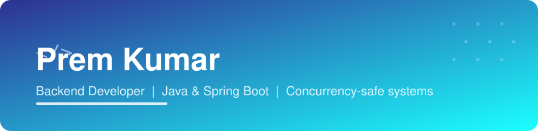

<div align="center">



<br><br>


<br><br>

<a href="https://www.linkedin.com/in/premkumarrajamani/"></a>
<a href="https://portfolio-prem3405.vercel.app/"></a>
<a href="https://leetcode.com/u/prem_cse_03/"></a>

</div>

<br>

## 🛠️ Tech Stack

<div align="center">


</div>

<br>

## 🚀 Projects

<div align="center">

<a href="https://github.com/prem-kumar3405/BANKING-MANAGEMENT-SYSYEM">

</a>

<a href="https://github.com/prem-kumar3405/REPLACE-WITH-YOUR-REPO-NAME">

</a>

</div>

<p align="center">
🏦 <b>Banking Management System</b> — Spring Boot backend engineered to survive concurrent access: optimistic locking, idempotency keys, and dedicated race-condition test suites.
</p>

<p align="center">
💬 <b>Real-Time Messaging App</b> — <i>send me the repo link/name and I'll fill in the real description, tech stack badges, and link here.</i>
</p>

<div align="center">


</div>

<br>

## 📊 GitHub Stats

<div align="center">


<br>


<br>


</div>

<br>

## 🎯 Currently

<div align="center">

```
🔭  Building V3 of my Banking System — auth, Docker, CI/CD
🌱  Deepening system design + concurrency fundamentals
💬  Ask me about optimistic locking & idempotent APIs
📫  Open to backend engineering roles
```

</div>

<br>

<div align="center">


</div>
